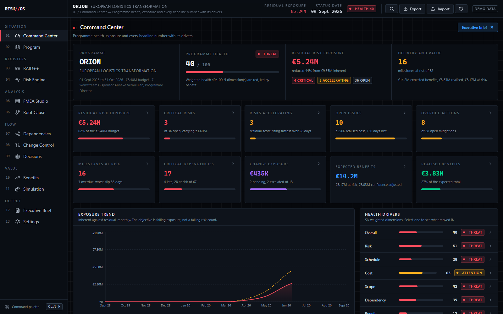
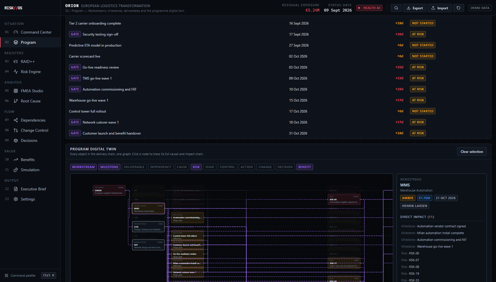
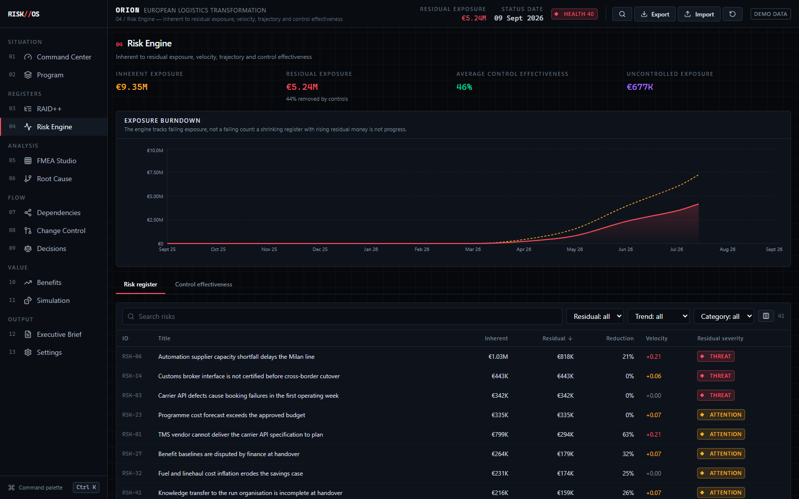
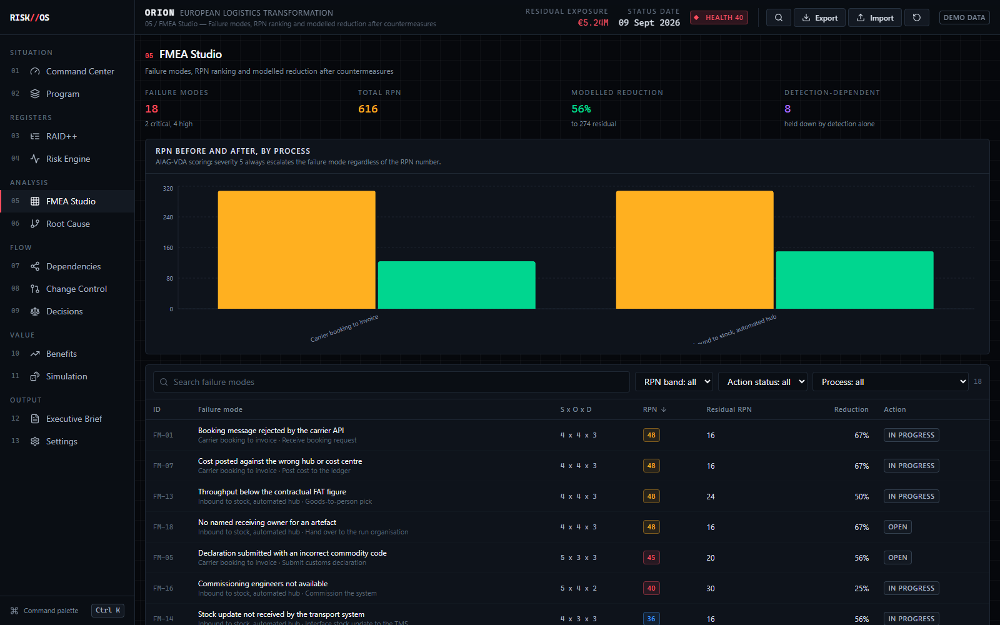
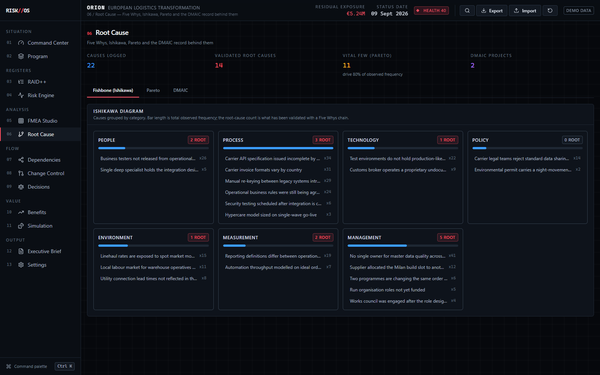
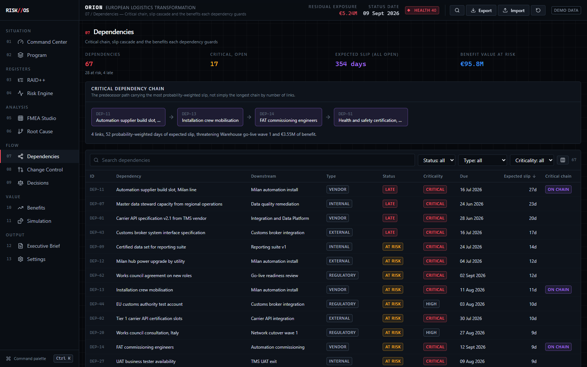
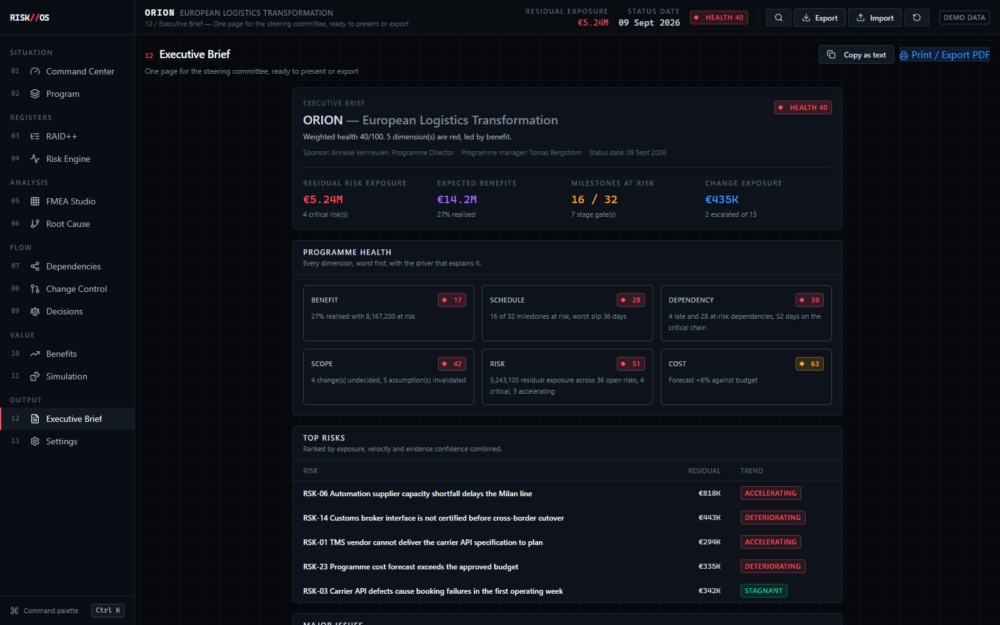
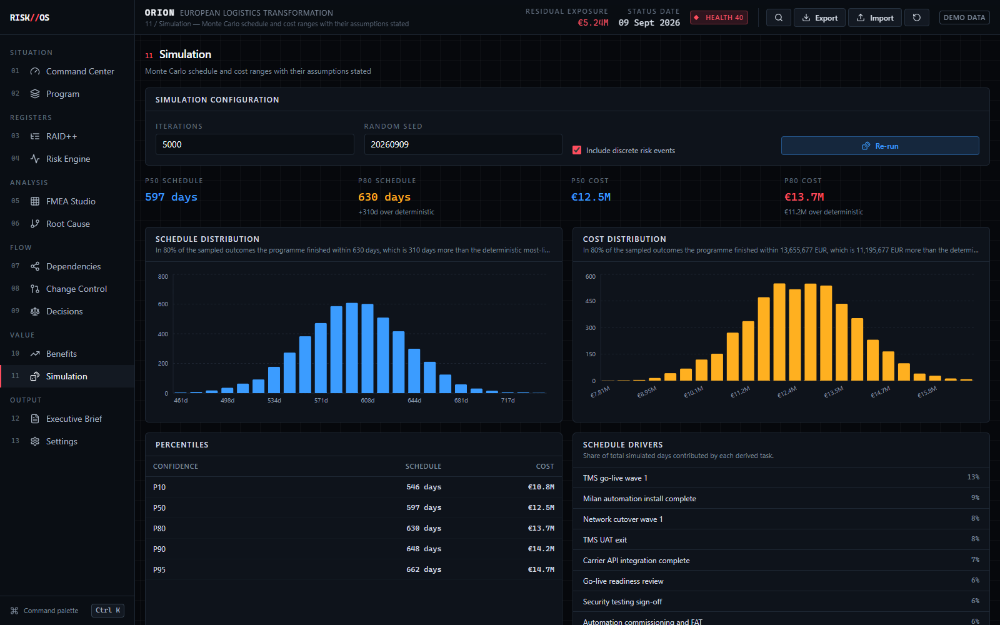

# RISK//OS

**See the risk. Model the impact. Control the program.**

**Live app:** [jeevan-0508.github.io/risk-os](https://jeevan-0508.github.io/risk-os/)

An open-source Program Risk & Delivery Operating System — the piece of software a program manager,
risk manager, PMO, or transformation lead would actually use to run a programme end-to-end, not a
generic project-tracker with a "risks" tab bolted on.

RISK//OS runs entirely in the browser. There is no backend and no login: everything is computed
client-side from a strongly-typed domain model, persisted to `localStorage`, and fully
import/exportable as JSON. It ships with one complete, internally-consistent demo programme —
**ORION, European Logistics Transformation** — so every screen shows real, cross-referenced data
from the first click.

---

## Why this exists

Most "risk registers" and "PM dashboards" show a flat list of rows with a red/amber/green colour
and stop there. They can tell you *that* something is red. They cannot tell you *why*, what it
threatens, what is being done about it, or whether that intervention is working. A dashboard that
cannot answer those questions is decoration, not a management tool.

RISK//OS is built around five questions that a serious operating system for a programme has to be
able to answer on every screen, for every number it shows:

1. **What is going wrong?**
2. **Why is it going wrong?** (root cause, not symptom)
3. **What does it threaten?** (milestones, benefits, other risks)
4. **What are we doing about it?** (controls, actions, decisions)
5. **Did the intervention actually reduce the risk?** (residual exposure, trend, RPN after countermeasure)

Nothing in the app is allowed to be an "unexplained number." Every KPI, every RAG status, every
health score is clickable and shows the calculation and the specific records that drove it.

## The problem with generic PM dashboards

| Generic dashboard | RISK//OS |
|---|---|
| Risk = probability × impact, shown once | Inherent → control effect → residual, with a transparent reduction % |
| RAG status is a manually-typed field | RAG status is *computed* from weighted drivers, and the drivers are shown |
| "47 risks" | "47 risks, 3 accelerating, €5.24M residual exposure, 11 with no linked control" |
| A dependency is a row with a due date | A dependency has a criticality index, a probability-weighted expected delay, and a plain-English sentence about which benefits it threatens |
| FMEA / DMAIC / root cause live in a spreadsheet nobody opens | They are first-class, connected objects in the same graph as the risks |
| Monte Carlo output presented as if it were a forecast | Every percentile is captioned "this describes the estimate ranges entered, not a forecast of what will happen" |

## The object model — the Program is the centre, not the register

```
PROGRAM
 └─ WORKSTREAM
     └─ MILESTONE ── DELIVERABLE
          ↑              ↑
     DEPENDENCY ────── RISK ── CAUSE
                          ↑        ↑
                      CONTROL   (5 Whys / Fishbone / Pareto)
                          ↑
                       ACTION
                          
CHANGE REQUEST ──▶ DECISION ──▶ OUTCOME
                          
RISK / DEPENDENCY / CHANGE ──▶ BENEFIT (expected → realised)
```

Every one of those object types is a real, separately-typed record in `src/domain/types.ts`, linked
by id, surfaced in its own screen, and rendered together in the **Program Digital Twin** (see below).
Nothing is duplicated: a milestone's risk exposure is *computed* from the risks that point at it, not
re-entered as a separate field.

---

## What's inside

### Screens (13)

| # | Screen | What it answers |
|---|---|---|
| 01 | **Command Center** | Every headline KPI, each one clickable to its drivers |
| 02 | **Program** | Workstreams, the 32-milestone delivery table, and the Program Digital Twin |
| 03 | **RAID++** | Risks / Assumptions / Issues / Dependencies as one linked register, not four flat tables |
| 04 | **Risk Engine** | Inherent → residual exposure, velocity, trend, priority ranking, burndown |
| 05 | **FMEA Studio** | Failure modes ranked by RPN, before/after countermeasure comparison |
| 06 | **Root Cause** | 5 Whys, Fishbone (7 categories), Pareto — connected to risks and issues |
| 07 | **Dependencies** | Critical chain, cascade of slip through the milestone graph, benefits at risk |
| 08 | **Change Control** | 6-axis impact assessment, decision workflow, change impact graph |
| 09 | **Decisions** | Options, rationale, evidence, expected vs. actual outcome, decision-quality score |
| 10 | **Benefits** | Expected vs. realised value, realisation curve, value at risk |
| 11 | **Simulation** | Monte Carlo (Beta-PERT) schedule/cost ranges, P10–P95, with assumptions stated |
| 12 | **Executive Brief** | One page for the steering committee — health, top risks, escalations, print/export |
| 13 | **Settings** | Import, export, create a blank programme, reset to demo, persistence status |

Global command palette (`Cmd/Ctrl+K`) jumps to any screen or searches risks, milestones, dependencies
and decisions by title.

### The Program Digital Twin (the signature feature)

`/program` renders every workstream, milestone, dependency, cause, risk, issue, control, action,
change, decision and benefit as one interactive graph (React Flow), laid out in causal-chain order
left to right rather than by force simulation, so the reading order matches the reasoning order.

Clicking any node — or any workstream card, or any row in the milestone table, they all drive the
same selection state — highlights that node's entire upstream/downstream chain and populates a side
panel with:

- Direct and indirect impact (capped and counted, e.g. "11 direct, 34 indirect")
- Affected owners and affected dates
- Benefits threatened, with their combined value
- Mitigations already in place
- A link to the record's full screen

Twelve toggle chips let you show or hide each object kind so the graph can be read at whatever level
of density the question requires — from "just the workstreams and benefits" up to the full 243-edge
picture.

---

## The risk model

Full formulas: [`docs/risk-model.md`](docs/risk-model.md). Summary:

Every risk carries an **inherent** assessment (probability, impact, financial and schedule exposure,
as if no control existed) and a **residual** assessment (the same, after the linked controls are
applied). The gap between the two, in money, is shown everywhere as the risk-reduction percentage.

**Worked example**, straight from the engine:

> A risk with €1.0M inherent financial impact and 100% inherent probability, covered by a control set
> whose combined effectiveness is 80%, reports a **€200K residual exposure** — an 80% reduction, shown
> next to the €1.0M inherent figure, not instead of it.

Controls are combined as **independent barriers**, not summed:

```
combined effectiveness = 1 − Π(1 − effectiveness_i)
```

Three 40%-effective controls combine to ~78%, not 120% — you cannot "remove" more than 100% of a
risk, and the model is capped at 95% combined reduction because no control set is perfect.

**Risk velocity** is not asserted, it is computed from the risk's own exposure history: the
percentage change in financial exposure, normalised to a 14-day window. A risk is classified
**accelerating** (≥15%/fortnight), **deteriorating** (>3%), **stagnant**, or **improving** (≤‑5%)
from that number, not from a manually-set flag. The Risk Engine screen plots this as a trajectory,
and the Risk Burndown chart tracks *falling exposure*, not falling headcount — a register can shrink
in row count while its financial exposure grows, and the burndown is built to show exactly that.

## Control effectiveness

Full model: [`docs/risk-model.md`](docs/risk-model.md#control-effectiveness). Each control's
effectiveness is `design × operating × status-weight × evidence-confidence × test-staleness`:
a control that is well-designed but only anecdotally evidenced, or whose assurance test is 90 days
overdue, is scored down from its stated design intent rather than taken on faith. Preventive and
directive controls reduce **probability**; detective and corrective controls reduce **consequence**
— they don't stop the event, they limit what it costs, and the model treats those as genuinely
different mechanisms rather than one generic "mitigation %."

## FMEA Studio

Full methodology: [`docs/fmea-methodology.md`](docs/fmea-methodology.md). Standard AIAG-VDA
Severity × Occurrence × Detection → RPN, but with the two things a raw RPN threshold misses:

- **Severity is an independent escalation trigger** — a Severity-5 failure mode is flagged regardless
  of its RPN, because AIAG-VDA guidance is explicit that a single RPN cut-off hides catastrophic/rare
  failure modes.
- **Detection-dependent flags** — a failure mode held down only because detection is strong (not
  because it's actually prevented) is called out: if the detection control fails, the full severity
  is exposed.

Every item shows post-countermeasure S/O/D and the resulting residual RPN, ranked and compared
before/after.

## Root Cause & DMAIC

Full methodology: [`docs/dmaic-methodology.md`](docs/dmaic-methodology.md) and
[`docs/fmea-methodology.md`](docs/fmea-methodology.md). Five Whys and Fishbone (People / Process /
Technology / Policy / Environment / Measurement / Management) causes are real records, connectable
to risks, issues and FMEA lines — not free text. Pareto ranks causes by frequency with the
conventional 80% cumulative "vital few" cut. DMAIC projects carry a real baseline defect rate,
converted to a Six Sigma level via the standard normal quantile (Acklam's rational approximation,
with the conventional 1.5σ short-term shift), and a gate-readiness check per phase (Define/Measure/
Analyze/Improve/Control) that is computed from whether the phase's actual prerequisites are met —
not a manually-ticked checkbox.

## Monte Carlo simulation

Full methodology, including the honesty caveats: [`docs/simulation-methodology.md`](docs/simulation-methodology.md).
Each schedule/cost task is sampled from a **Beta-PERT** distribution built from its optimistic/most
likely/pessimistic estimate (λ=4, the standard PERT weighting). Linked risks can additionally fire as
Bernoulli trials at their residual probability. The result is presented as P10–P95 with a fixed,
visible assumption list, and every percentile explanation ends with the same sentence:

> *"This describes the estimate ranges that were entered, not a forecast of what will happen."*

There is no synthetic confidence added anywhere in the UI — a P80 is a statement about the model, and
is labelled as one.

## Benefits realisation

Full model: [`docs/benefit-model.md`](docs/data-model.md). Each benefit tracks expected value,
realised value, a target date, and the milestones/risks/changes/decisions linked to it. Realisation
% and value-at-risk are computed, not entered, and the health engine's benefit dimension explicitly
penalises benefits realising *slower than the programme's own elapsed-time percentage* — a benefit
that's "on track" only because nobody has checked the pacing shows up here.

## Program health — transparent by construction

Full model: [`docs/health-model.md`](docs/health-model.md). The headline RAG status is a weighted
average of six dimension scores (Risk 24%, Schedule 22%, Dependency 16%, Cost 15%, Benefit 14%,
Scope 9% — weighted toward the two things a PM can still act on), and **every point removed from
100 is attributed to a named driver with its own plain-English detail line** — "Residual exposure of
€5,240,000 is 62% of the €8,400,000 budget," not "Risk: RED." A programme is never shown green while
one dimension is red — a single red dimension caps the overall status at amber, two or more force it
to red — because a programme manager should never have a green headline masking a genuinely broken
axis.

---

## Architecture

Full detail: [`docs/architecture.md`](docs/architecture.md).

```
src/
  domain/
    types.ts            strongly-typed domain model (Program, Risk, Control, ...)
    validate.ts          defensive import validation — never throws
    engines/              pure, deterministic, unit-tested business logic
      riskEngine.ts        inherent→residual exposure, velocity, trend, burndown
      controlEngine.ts      control effectiveness, independent-barrier combination
      scheduleEngine.ts     milestone/action assessment, SPI proxy
      dependencyEngine.ts   critical chain, cascade, plain-language impact
      changeEngine.ts       change impact axes + decision quality
      benefitEngine.ts       realisation %, value at risk, pacing
      fmeaEngine.ts          RPN, bands, before/after
      dmaicEngine.ts         Pareto, sigma level, gate readiness
      healthEngine.ts        weighted RAG with attributed drivers
      simulationEngine.ts    Beta-PERT Monte Carlo
      graphEngine.ts         digital-twin node/edge build + chain trace
      kpiEngine.ts           Command Center KPI explanations
  state/
    store.ts              Zustand store — the only place engines are called from screens
    analytics.ts          memoised derived analytics (health, burndown, twin graph, ...)
    persistence.ts        localStorage read/write, JSON import/export
  screens/                one file per route, presentation only — no business logic
  ui/                     shared primitives (DataTable, SlideOver, Panel, RagBadge, ...)
  data/orion.ts            the ORION demo programme (generated, hand-checked for consistency)
```

**Rule enforced throughout:** a screen file never computes a business number. Every figure a screen
renders comes from an engine function or from `analytics`, which memoises the engine outputs against
the current `program`. This is what makes "click a KPI, see its drivers" possible everywhere instead
of in one hand-built place — the explanation is a side-effect of the calculation already being
structured, not a separate feature bolted onto the display.

### Technical decisions

- **React + TypeScript + Vite + Tailwind** — no server, so the whole stack has to be fast to iterate
  in a single-page bundle. Vite's dev server and esbuild-based build were the deciding factor over CRA.
- **Zustand over Redux** — one flat store, no boilerplate slices, and its subscription model matches
  a UI where nearly every screen reads the same `program`/`analytics` pair.
- **localStorage over IndexedDB** — the entire ORION programme JSON-serialises to well under the
  ~5MB localStorage ceiling (see the actual export size below), so IndexedDB's async API would have
  added complexity with no benefit at this data volume. `src/state/persistence.ts` isolates the
  storage call behind one module, so swapping it later is a one-file change.
- **React Flow for the Digital Twin** — the twin needs real pan/zoom/drag and per-node custom
  rendering with typed handles; a straightforward `<canvas>`/D3 layout would have meant
  re-implementing pan, zoom, edge routing and node dragging by hand for no reason.
- **Recharts** for the burndown, benefit-curve and simulation-histogram charts — declarative, themed
  once in `src/ui/chart.tsx`, and sized well for the number of series this app needs (never more than
  five or six per chart).
- **No backend, by design** — the spec calls for local-first persistence with JSON import/export; a
  backend would add auth, hosting and multi-user conflict-resolution problems the brief never asked
  for, so it was deliberately left out rather than half-built.

---

## Demo programme: ORION, European Logistics Transformation

A 14-month, €8.4M programme, generated once and hand-checked so every object connects logically —
no random disconnected fake data. Counts, verified against the loaded dataset:

7 workstreams · 32 milestones · 26 deliverables · 41 risks · 22 causes · 32 controls · 34 actions ·
12 issues · 12 assumptions · 67 dependencies · 13 changes · 10 decisions · 9 benefits (€14.2M
expected) · 18 FMEA lines · 2 DMAIC projects · 6 metrics.

Three named causal scenarios are threaded through the data end-to-end (not just described — every
object in the chain exists and is linked):

- **Vendor Delay → API Integration → Security Testing → Go-Live → Customer Launch → €1.2M Benefit**
- **Data Quality Issue → Reporting Failure → Steering Committee Decision → Scope Change → Schedule Impact**
- **Supplier Capacity → Dependency Risk → Milestone Delay → Revenue Benefit Exposure**

### Demo walkthrough (what you'll actually see)

1. Open the app. **Command Center** shows Health **40/100, RED**, residual exposure **€5.24M**,
   **3 accelerating risks**, **16 of 32 milestones at risk**, **€14.2M expected / €3.83M realised
   (27%)** benefit. Click any KPI card — a drawer opens showing exactly which risks, milestones or
   benefits produced that number.
2. Go to **Program** → the workstream grid shows two flagged **AT RISK** (TMS, INT, WMS). Click one —
   the Digital Twin below highlights its full chain and the info panel lists its direct/indirect
   impact and threatened benefits.
3. Go to **Dependencies** → sort by criticality; the worst dependency's detail panel states its
   impact in plain language ("If this slips N days, these milestones are affected, which threatens
   €X in benefits") rather than leaving you to infer it from a due date.
4. Go to **Simulation** → run Monte Carlo on the derived task set, read the P80 schedule figure and
   its caption, and note it never claims to be a forecast.
5. Go to **Executive Brief** → one scroll, print/export ready, every line item still links back to
   its own screen.

### Screenshots

| Command Center | Program & Digital Twin |
|---|---|
|  |  |

| Risk Engine | FMEA Studio |
|---|---|
|  |  |

| Root Cause | Dependencies |
|---|---|
|  |  |

| Executive Brief | Simulation |
|---|---|
|  |  |

---

## Import / export / persistence

No backend, by design. `Settings` (and the top bar) let you:

- **Export** the whole programme as JSON (`riskos-orion-<statusDate>.json`, ~390KB for the full ORION dataset).
- **Import** any previously-exported JSON — validated defensively (see below), never crashes on a
  malformed file.
- **Create a blank programme** from a short form (name, codename, dates, budget) and build it up from
  nothing.
- **Reset to the ORION demo** at any time (two-step confirm).

State autosaves to `localStorage` (`riskos.state.v1`) on every change; a reload restores exactly
where you left off. If `localStorage` is unavailable (private browsing, storage quota), the app
degrades to in-memory only and says so in Settings rather than failing silently.

## Error handling

`src/domain/validate.ts` is the single gate every import passes through: missing relationships,
invalid dates, non-numeric fields, and structurally-empty datasets are caught and reported with a
specific message (which field, which record) rather than a stack trace. A bad import shows a toast
and leaves the current programme untouched — it never partially applies a broken import.

## Accessibility

Keyboard navigation works throughout (`Tab`, `Cmd/Ctrl+K` for the command palette, arrow keys inside
it, `Esc` to close panels). A skip-link is present. `DataTable` headers expose `aria-sort`; `Meter`
exposes `role="meter"`; status is never colour-only — every RAG state also carries a text label.
Focus is trapped inside `SlideOver` panels while open. This has not been run through a dedicated
screen-reader test session — see Limitations below.

## Testing

**230 unit tests across 12 files**, one per engine, covering the business logic — the layer this
spec explicitly calls out as needing coverage (`riskEngine`, `healthEngine`, `fmeaEngine`,
`dependencyEngine`, `changeEngine`, `benefitEngine`, `simulationEngine`, `controlEngine`,
`dmaicEngine`, `graphEngine`, `scheduleEngine`, `kpiEngine`). Engines are pure functions of their
inputs, so every test is deterministic — no mocked clocks or network, no flaky timing.

```bash
bun x tsc -p tsconfig.app.json --noEmit   # typecheck
bun run build                              # production build
# vitest via bun's loader is currently broken on Windows for this project;
# run via node directly if `bun test` fails to start:
node node_modules/vitest/vitest.mjs run
```

## Running it

```bash
bun install
bun run dev      # http://localhost:5173
bun run build    # production bundle to dist/
bun run deploy   # rebuilds and copies dist/ into docs/, for GitHub Pages
```

GitHub Pages is configured to serve from `main` / `/docs` — `docs/` holds both the built app
(`index.html`, `assets/`) and the methodology markdown files side by side; `bun run deploy` is the
one command that keeps the served build in sync with the latest source.

## Roadmap / known limitations (stated honestly)

- **Single production bundle (~1.22MB, ~332KB gzipped)** exceeds Vite's 500KB chunk warning. The app
  is fast in practice at this size, but route-level code-splitting (`React.lazy` per screen, or
  `manualChunks` for `@xyflow/react` and `recharts`) is the correct next step if the app grows further
  and hasn't been done yet — deferred deliberately rather than added speculatively.
- **No dedicated screen-reader test pass.** The accessibility primitives (focus trap, `aria-sort`,
  semantic tables, never colour-only) are in place and typechecked, but have not been verified with
  NVDA/VoiceOver.
- **Single-user, no backend, by design** — there is no multi-user collaboration, no server-side
  audit trail, and no auth. That is a deliberate scope decision for a local-first tool, not an
  oversight.
- **Monte Carlo assumes independent task durations.** Real programmes have correlated delays, so the
  simulated spread is narrower than reality — this is stated explicitly in the simulation's own
  assumption list, not hidden.
- **Documentation methodology is restated from the implemented engines**, not independently
  peer-reviewed against a Six Sigma or risk-management certification body. The formulas are real and
  testable (see the `*.test.ts` files next to each engine), but "correct per AIAG-VDA / ISO 31000" is
  a design intent, not a certification claim.

Everything else described in this README — every screen, every calculation, the demo data
relationships, import/export, persistence, and the test suite — was run and observed working as part
of building this application, not assumed.

## Licence

MIT — see [LICENSE](LICENSE). Copyright (c) 2026 Jeevan Siddhabhaktula.

Built by [Jeevan Siddhabhaktula](https://github.com/Jeevan-0508). Companion projects:
[AI Governance Control Room](https://github.com/Jeevan-0508/ai-governance-control-room) ·
[Freight Fraud Taxonomy](https://github.com/Jeevan-0508/freight-fraud-taxonomy) ·
[Freight Risk Atlas](https://github.com/Jeevan-0508/freight-risk-atlas)
